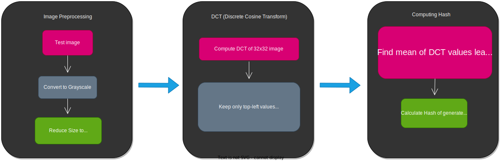
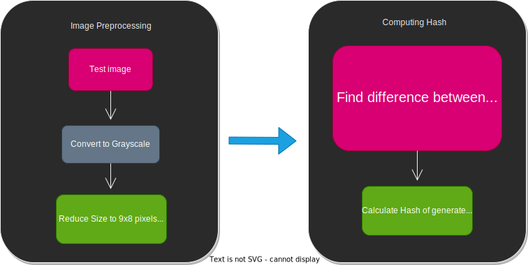
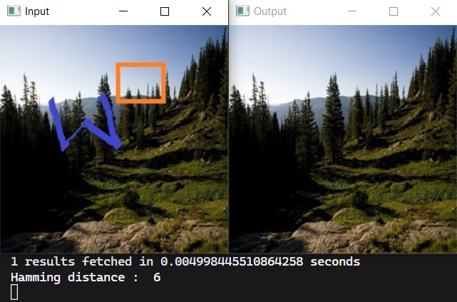

# Hash-hunt

Reverse image searching engine based on Dhash image hashing technique.

This dhash algorithm  is based on 
<a href="https://www.hackerfactor.com/blog/?/archives/529-Kind-of-Like-That.html">Kind of like that</a> by Dr. Neal Krawetzy.

# Description

## What is Image hashing ?
Image hashing is the process of using an algorithm (here dhash) to assign a unique hash value to an image.

### Test Image


### Generated hash using dhash algorithm: 784806da92483094

## Phash algorithm

<br />


<br />

## Dhash algorithm

<br />


<br />

## How Image hashing works with fast search on Images ?

* Hash value of input images is calculated using dhash algorithm.
* This hash value and it's corresponding image is stored in database.
* Then **VPTree** is used to store hashvalues of images on the based of hamming distance between them.
* On searching particular image it's hash value is calculated which is then passed to VPTree, it finds related images based on the hamming distance between calculated hash and stored hash values.

## Getting Started

### Dependencies 

* OpenCV
* Python 3

### Executing program

* Clone this repository

```
git clone https://github.com/Anant-mishra1729/Hash-hunt.git
```
* For indexing images execute
```
python index_images.py 

--images or -i : Path to source directory of images to index

--tree or -t : Path to vptree file

--hashes or -a : Path to generated image hash file
```

* For searching an image execute
```
python search.py 

--image or -i : Image to search

--tree or -t : Path to generated VPtree

--hashes or -a : Path of generated hash file
```

## Results
Images are taken from <a href = "https://www.kaggle.com/datasets/erennik/places">dataset</a>



## Contributors

<a href="https://github.com/Anant-mishra1729">Anant Mishra</a>

## License

This project is licensed under the MIT License - see the LICENSE.md file for details

## Acknowledgments
<a href="https://www.hackerfactor.com/blog/?/archives/529-Kind-of-Like-That.html">Kind of like that</a> by Dr. Neal Krawetzy.
